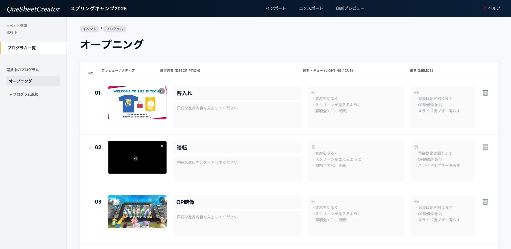

# CueSheetCreator


CueSheetCreator は、イベント進行表や照明・音響向けのキューシートをブラウザだけで作成・編集・共有・印刷できる、ビルド不要のローカル Web アプリです。



## 概要

- `index.html` を開くだけで使い始められます。
- 編集内容はブラウザの `localStorage` に自動保存されます。
- 共有やバックアップ用に `.cuesheet` ファイルを書き出せます。
- 印刷プレビューから、現場配布用の PDF や紙のキューシートを作れます。

## 主な機能

- イベント名、プログラム、シーン単位で進行表を整理
- 画像のドラッグ&ドロップ配置と自動リサイズ
- シーンの並び替えと連番の自動振り直し
- `.cuesheet` 形式でのエクスポート / インポート
- `Ctrl+S` / `Command+S` によるクイック保存
- 印刷用レイアウトへの自動切り替え

## 使い方

1. ブラウザで `index.html` を開きます。
2. イベント名とプログラム名を入力し、シーンを追加します。
3. 各シーンに進行内容、照明キュー、備考、必要に応じて画像を登録します。
4. 共有やバックアップが必要なときは「エクスポート」または `Ctrl+S` / `Command+S` で `.cuesheet` を保存します。
5. 配布用の出力が必要なときは「印刷プレビュー」から PDF 保存または印刷を行います。

## 保存と共有

- 自動保存先はブラウザの `localStorage` です。
- ブラウザのキャッシュ削除や端末変更では `localStorage` の内容は引き継がれません。
- 長期保存や他メンバーとの共有には `.cuesheet` の書き出しを使ってください。
- `.cuesheet` の実体は ZIP ファイルで、テキスト情報と画像を 1 ファイルにまとめています。

## ローカル書き出し先

リポジトリ直下の `cuesheets/` は、各開発者や利用者がローカルで `.cuesheet` を整理して置くための想定ディレクトリです。

- `cuesheets/` ディレクトリ自体はリポジトリに含めています。
- 中に書き出した `.cuesheet` ファイルは Git 管理対象外です。
- ブラウザの保存先はアプリから強制できないため、必要に応じて保存時に `cuesheets/` を選んでください。

## 動作環境

- モダンブラウザの最新版を推奨
- JavaScript 有効
- ローカルファイルを開けるデスクトップ環境

## ディレクトリ構成

```text
.
├── index.html
├── css/
├── js/
├── docs/
└── cuesheets/
```

## ドキュメント

- `docs/ARCHITECTURE.md`: 実装方針とデータ構造
- `docs/DESIGN.md`: デザイン方針

## バージョン

- 現在のバージョン: `v1.1.0`
- Git タグ: `v1.1.0`
- GitHub のリリースタグと連動したバージョン表示にも移行できます

GitHub の `origin` とタグが用意できたら、README のバージョン表記は GitHub のリリースバッジに置き換えられます。たとえば `https://img.shields.io/github/v/release/<owner>/<repo>` のようなバッジを使うと、よく見る GitHub 風のバージョン表示にできます。

## ライセンス

[MIT](LICENSE)
